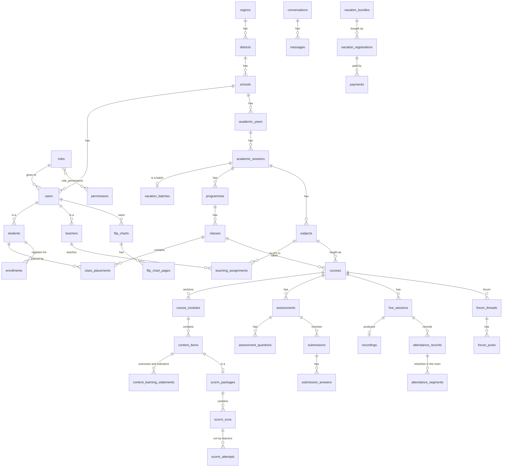

# Database schema

[`schema.sql`](schema.sql) is the database behind ClassRoom LMS Project, for the Laravel API that will replace the prototype's in-browser store. It is written for **MySQL 8.0+ or MariaDB 10.6+**. It is checked by loading it into a fresh MariaDB 10.11 database: 72 tables and 181 foreign keys.

```bash
mysql -u root -e "CREATE DATABASE classroom_lms CHARACTER SET utf8mb4"
mysql -u root classroom_lms < database/schema.sql
```

Laravel's own tables (`sessions`, `cache`, `jobs`, `failed_jobs`) come from the framework's migrations and aren't repeated here. When the API is built, `schema.sql` is what its migrations should produce.

## Keeping it up to date

The schema, the spec and `lib/types.ts` describe the same data. When a change adds, changes or removes an entity or a field, update in the same change:

1. `lib/types.ts` and the seed (bump `DB_VERSION`);
2. `database/schema.sql`: the table, its keys and a comment on anything not obvious;
3. this README's collection map, if a collection or table was added;
4. the spec, including its Change Log row.

Then reload `schema.sql` into an empty database to check it still runs.

## How tenancy works

- **One shared database.** Each school is a tenant: every row a school owns has `school_id`, and the API scopes every query to the signed-in user's school. The Super Administrator sees every school.
- **Academic records also carry `session_id`** (programmes, classes, subjects, enrollments, courses, assessments, live classes, attendance…), so one academic year's data never mixes with another's (spec section 7, section 60).
- **Vacation Classes is a tenant too** (`schools.kind = 'vacation'`). A school student who registers for vacation classes gets a second `students` row, in the vacation workspace, for the same user.

## Sign-in names (spec section 10.1)

| Who | Signs in with | Column |
|---|---|---|
| Everyone | Platform username (`cp` + number, never changes) | `users.username` (unique) |
| Everyone with an email | Email | `users.email` (unique) |
| Students | School username `WAECCODE-NNNN-YY` | `students.school_username` (unique) |
| Teachers | Staff ID | `teachers.staff_number` (unique within a school; the password picks the account if two schools share one) |
| School administrators | Only the school's WAEC or GES EMIS code | `schools.waec_code` / `schools.ges_emis_code` (unique) |

## Relationships



## Table groups

| Group | Tables |
|---|---|
| Platform | `platform_settings`, `regions`, `districts`, `catalogue_programmes`, `catalogue_subjects`, `catalogue_subject_programmes` |
| Tenants | `schools` |
| Access | `permissions`, `roles`, `role_permissions`, `users`, `password_reset_tokens` |
| Academic | `academic_years`, `academic_sessions`, `vacation_batches`, `catalogue_requests`, `programmes`, `teachers`, `classes`, `subjects`, `students`, `student_subject_interests`, `class_placements`, `teaching_assignments`, `enrollments` |
| Files | `files` |
| LMS | `courses`, `course_modules`, `content_items`, `content_learning_statements`, `lesson_progress`, `library_topics`, `library_materials`, `library_progress` |
| SCORM | `scorm_packages`, `scorm_scos`, `scorm_attempts` |
| Assessments | `assessments`, `assessment_questions`, `submissions`, `submission_answers` |
| Live classroom | `live_sessions`, `live_session_pauses`, `live_session_breakouts`, `live_session_removals`, `recordings`, `flip_charts`, `flip_chart_pages` |
| Attendance | `attendance_records`, `attendance_segments` |
| Communication | `notifications`, `notification_reads`, `email_outbox`, `sms_outbox`, `conversations`, `conversation_participants`, `messages`, `message_reads`, `forum_threads`, `forum_posts`, `forum_thread_reads`, `announcements`, `school_events` |
| Vacation Classes | `vacation_prices`, `vacation_price_classes`, `vacation_bundles`, `vacation_bundle_classes`, `vacation_bundle_subjects`, `vacation_registrations`, `vacation_registration_subjects`, `payments` |
| Audit | `audit_logs` |

## From the prototype's store to tables

The prototype keeps lists inside records (for example, who has read a notification). Here those lists are tables of their own.

| Prototype (`lib/data/seed.ts` `DB`) | Tables |
|---|---|
| `settings` | `platform_settings` (a single row) |
| `schools` (`branding`, `contentProtection`) | `schools` (`brand_*`, `*_downloads` columns) |
| `roles[].permissions` | `permissions`, `role_permissions` |
| `users`, `passwords` | `users` (`password` is a hash) |
| Interface language (`localStorage` `classproject-lang` in the prototype, per device) | `users.locale` (`en`, `fr`, `pt`, `es`), so the choice follows the person to every device |
| `academicSessions[].batch` | `vacation_batches` |
| `placements` | `class_placements` |
| `modules` | `course_modules` |
| `contents` (`learningOutcomes`, `learningIndicators`) | `content_items`, `content_learning_statements` |
| `contents[].scorm` | `scorm_packages`, `scorm_scos` |
| `contents[].refId` | `content_items.assessment_id` / `live_session_id` / `recording_id` |
| `scormAttempts` | `scorm_attempts` (the CMI data model as JSON) |
| `assessments[].questions` | `assessment_questions` |
| `submissions[].answers` | `submission_answers` |
| `liveSessions` (`pauses`, `breakouts`, `removedUserIds`, `controls`) | `live_sessions`, `live_session_pauses`, `live_session_breakouts`, `live_session_removals` |
| `attendance[].segments` | `attendance_segments` |
| `notifications[].readBy` | `notification_reads` |
| `emails` | `email_outbox` |
| `smsMessages` | `sms_outbox` (guardian alerts, one per student, class and kind) |
| `schools[].guardianAlerts` | `schools.guardian_alert_*` columns |
| `conversations[].participantIds` | `conversation_participants` |
| `messages[].readBy` | `message_reads` |
| `forumThreads[].readBy` | `forum_thread_reads` |
| `events` | `school_events` |
| `progress` | `lesson_progress` (course items) and `library_progress` (library materials) |
| `libraryTopics`, `libraryMaterials` | `library_topics`, `library_materials` |
| `students[].moocInterests`, `students[].moocHidden` | `student_subject_interests` (`kind` = interest / hidden) |
| `flipCharts[].pages` | `flip_chart_pages` (strokes as JSON) |
| `vacationPrices[].classIds` | `vacation_price_classes` |
| `vacationBundles` (`classIds`, `subjectIds`) | `vacation_bundle_classes`, `vacation_bundle_subjects` |
| `vacationRegistrations` (`subjectIds`, `payment`) | `vacation_registration_subjects`, `payments` |
| Uploaded files (data URLs and IndexedDB in the prototype) | `files`, referenced by `file_id` columns |

**Not stored in the database:**
- `schools[].stats`: headline counts for schools the prototype doesn't load in full. The API computes them.
- The teacher's camera background: remembered on the teacher's own device.
- The live room's moment-to-moment state (who's on stage, hands raised, the laser pointer): it travels through the live video provider. The whiteboard is saved to `flip_chart_pages` when the teacher saves it.
- ClassProject Open course recommendations: they come from Open's partner API, cached for 24 hours (spec section 49.2). ClassProject Open has **its own, separate database**, in [`mooc/database/`](../mooc/database/README.md).
- The one-session-per-person rule: the video provider enforces it, because a second connection with the same identity replaces the first.
