# ClassProject Project Map

Mermaid diagrams of the ClassProject LMS and virtual classroom prototype, generated from the product specification and codebase (28 Sep 2026). Open `docs/project-map.html` in a browser for the interactive version: click a box for what it is and where it lives in the code, zoom, drag and search.

## System overview

The people, the four portals and shared areas, the data layer, and the services the prototype simulates today.

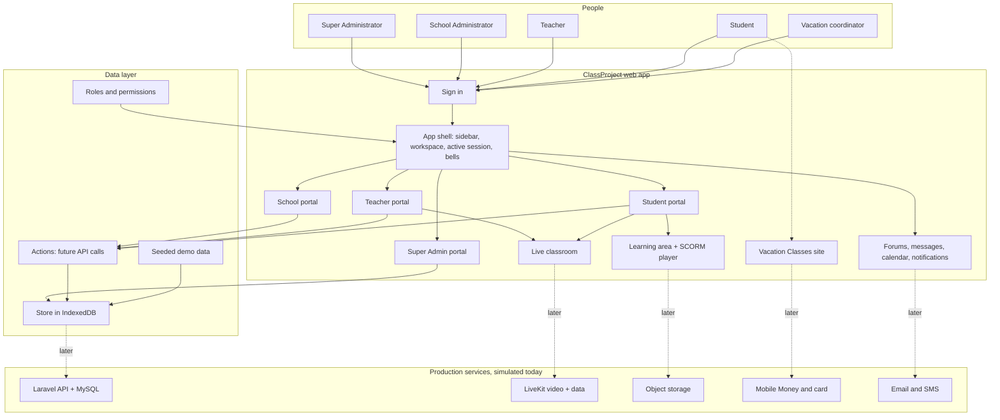

Click any box for details. Drag to move, use the buttons to zoom.

## Sign-in and roles

One field takes an email, username, staff ID or school code. Every user has exactly one role, which decides their portal.

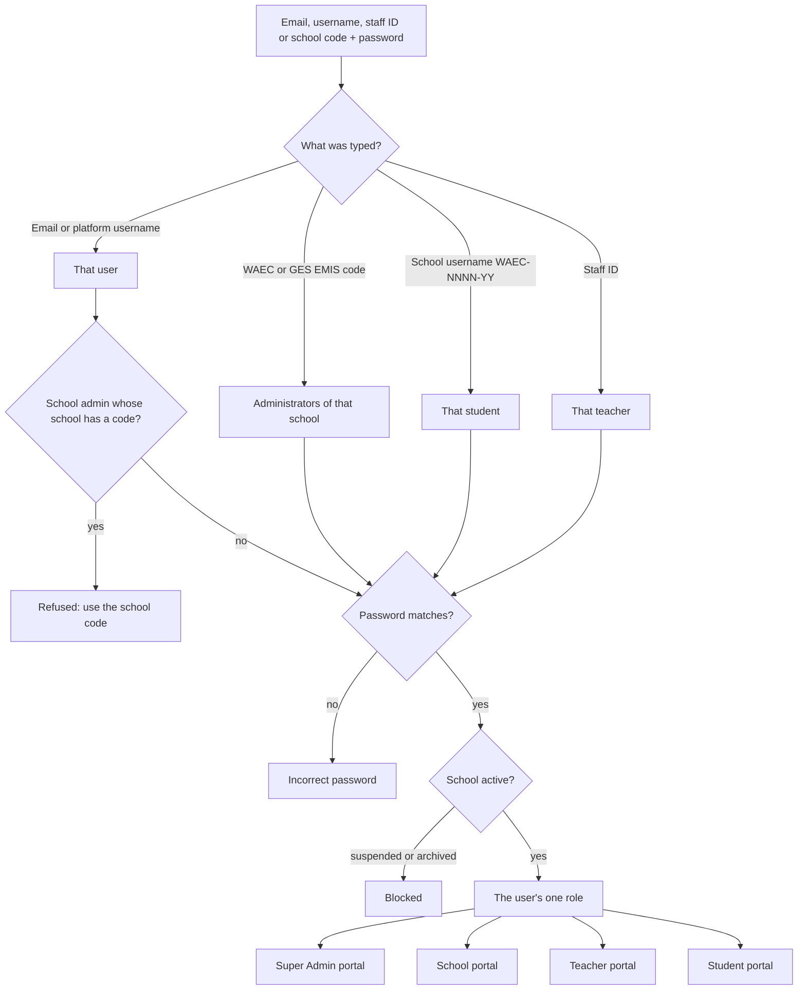

Staff IDs used at two schools ask the teacher to use their email or platform username instead.

## Data model

Every tenant record carries its school, and every academic record its session, so schools and years never mix.

```mermaid
erDiagram
  SCHOOL {
    string waecCode
    string emisCode
    string category
    string ownership
    string kind
  }
  USER {
    string username
    string email
    string roleId
  }
  STUDENT {
    string studentNumber
    string schoolUsername
    string indexNumber
  }
  TEACHER {
    string staffNumber
  }
  SCHOOL ||--o{ ACADEMIC_YEAR : has
  ACADEMIC_YEAR ||--o{ SESSION : "semesters or terms"
  SCHOOL ||--o{ USER : "home school"
  USER ||--o| STUDENT : "student record"
  USER ||--o| TEACHER : "teacher record"
  SESSION ||--o{ CLASS : has
  SESSION ||--o{ SUBJECT : offers
  CLASS ||--o{ PLACEMENT : holds
  STUDENT ||--o{ PLACEMENT : "placed in"
  STUDENT ||--o{ ENROLLMENT : takes
  SUBJECT ||--o{ ENROLLMENT : "taken by"
  COURSE }o--|| CLASS : for
  COURSE }o--|| SUBJECT : teaches
  COURSE }o--|| TEACHER : "taught by"
  COURSE ||--o{ MODULE : sections
  MODULE ||--o{ CONTENT : items
  COURSE ||--o{ ASSESSMENT : has
  ASSESSMENT ||--o{ SUBMISSION : receives
  STUDENT ||--o{ SUBMISSION : makes
  COURSE ||--o{ LIVE_SESSION : schedules
  LIVE_SESSION ||--o| RECORDING : produces
  LIVE_SESSION ||--o{ ATTENDANCE : records
  CONTENT ||--o{ SCORM_ATTEMPT : tracks
  STUDENT ||--o{ SCORM_ATTEMPT : makes
  CONTENT |o--o| ASSESSMENT : "SCORM grade item"
  USER ||--o{ VACATION_REGISTRATION : registers
```

Types live in `lib/types.ts`; the seeded database shape is `DB` in `lib/data/seed.ts`.

## Academic structure

From a school's profile down to a single lesson. The sidebar shows the active session; sessions are set and viewed on the Academic Sessions page.

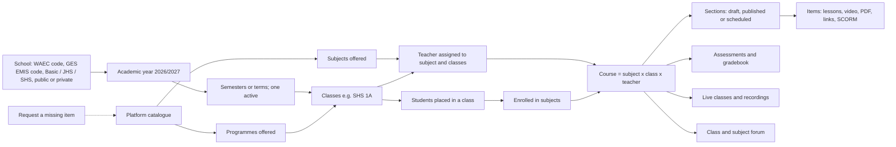

Programmes and subjects come from the platform catalogue; schools request anything missing and are notified when it's added.

## School onboarding and usernames

Schools can be added one at a time or uploaded in bulk; missing details are collected from the school administrator before setup continues.

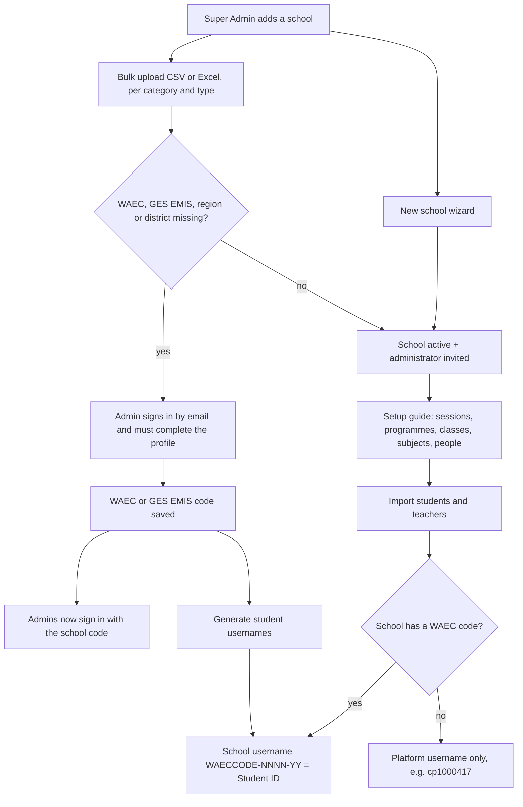

Every user also has a permanent platform username that other TechMawu products integrate against.

## Live class lifecycle

The status in class lists follows the clock, so a due class can always be started from the list.

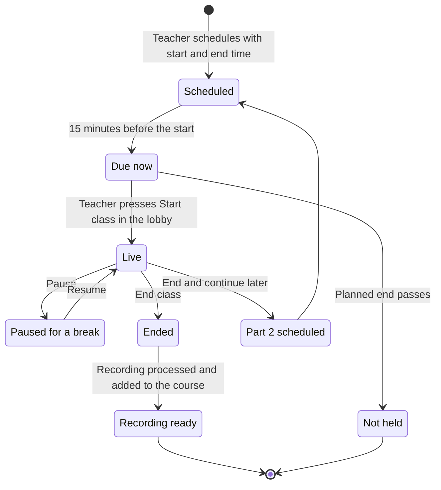

Students are notified when a class is scheduled and again when it starts.

## Classroom stage sync

The teacher owns the main stage. Students receive only what they are allowed to see.

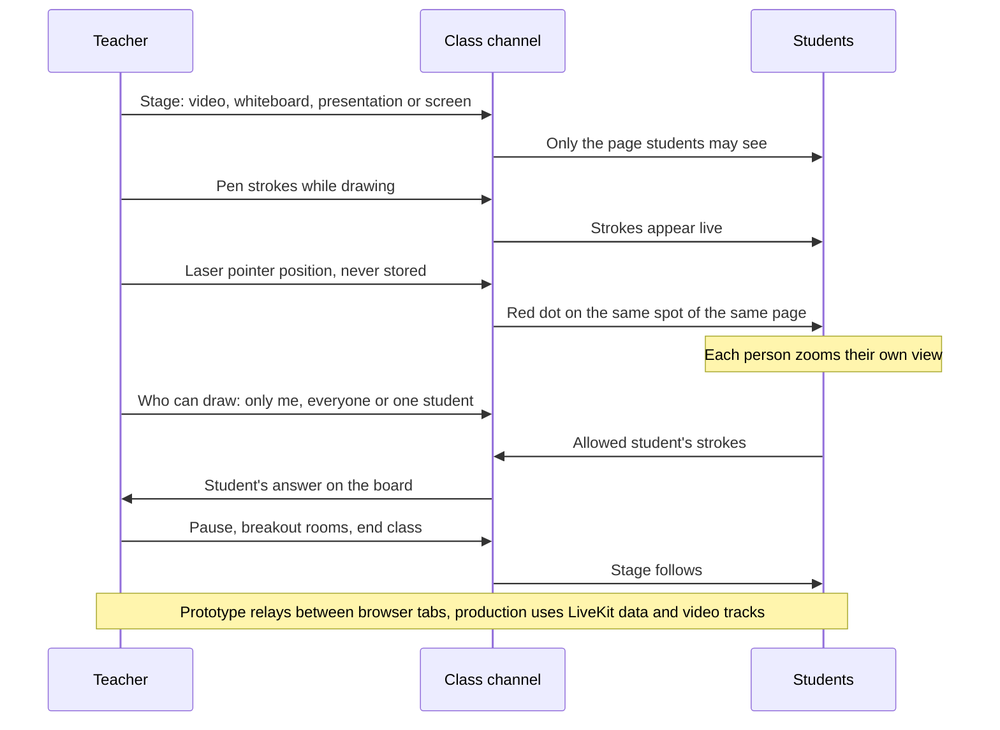

Code: `components/classroom/stage-sync.ts`, `whiteboard.tsx`, `app/classroom/[id]/page.tsx`.

## Presenting

Whatever is presented opens on the board, so pen, highlighter, laser and zoom work on it.

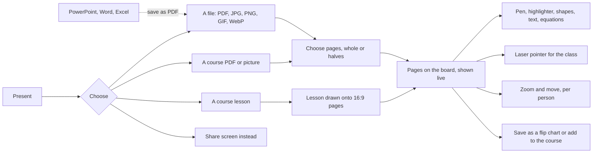

Screen sharing carries the shared tab's or screen's sound where the browser allows it.

## SCORM import, play and export

SCORM 1.2 and 2004 packages play in-app with the full run-time API; any course can leave the platform as a SCORM package.

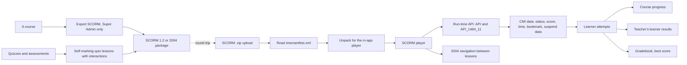

Code: `lib/scorm/*`, `components/course/scorm-*.tsx`, `public/scorm-content/sw.js`.

## Vacation Classes

A separate paid workspace with every LMS feature, open to students from any school or none.

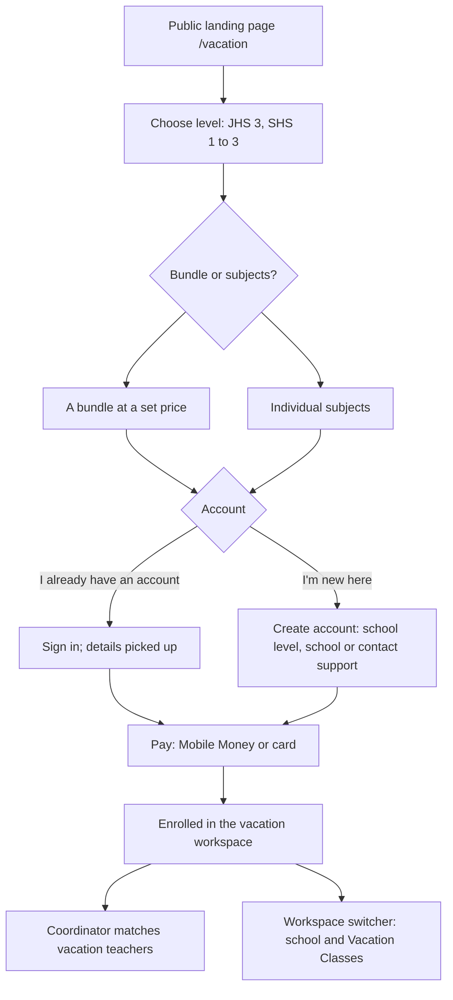

Registrations stay "awaiting payment" until paid; only paid students are enrolled.

## Portal navigation

What each role finds in the sidebar. Access is by permission, never by role name.

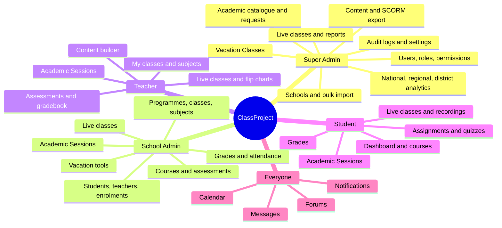

Navigation is defined in `lib/nav.ts`; permissions in `lib/permissions.ts`.

## Code map

Where things live in the repository.

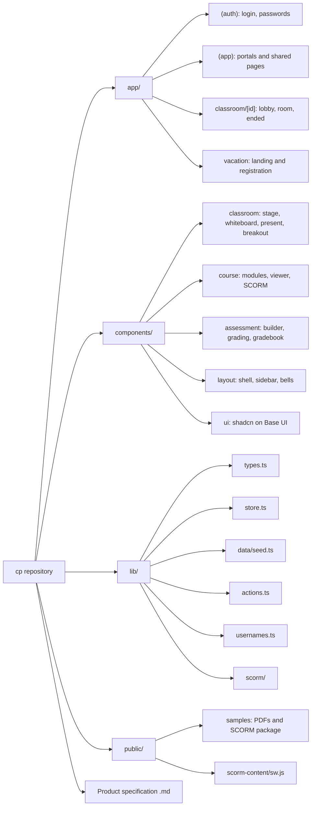

Everything multi-step goes through `lib/actions.ts`, so moving to the Laravel API is a data-layer change.
